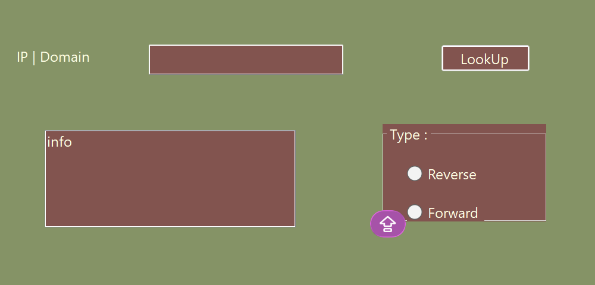

# DNS-LOOKUP-APPLICATION

## 📌 Description
This is a simple DNS Lookup application built using C# and Windows Forms.   It allows users to convert a domain name into an IP address (Forward Lookup) or an IP address into a domain name (Reverse Lookup).
## 🖥️ User Interface
The application includes:
- Input field for domain or IP  
- "LookUp" button  
- Information box to display results  
- Option to select lookup type (Forward / Reverse)
## ⚙️ Features
- Convert domain names to IP addresses  
- Reverse lookup (IP to domain)  
- Simple and easy-to-use interface
- ## ▶️ How to Use
1. Enter a domain (e.g., google.com) or an IP address  
2. Choose the lookup type (Forward or Reverse)  
3. Click the "LookUp" button  
4. View the result in the info box

 ## 🛠️ Technologies Used
- C#
- Windows Forms (.NET)

## 📚 Purpose
This project was created as a simple academic assignment to demonstrate how DNS works.

## 👩‍💻 Author
Student project(Zubeyde ALsalman).

